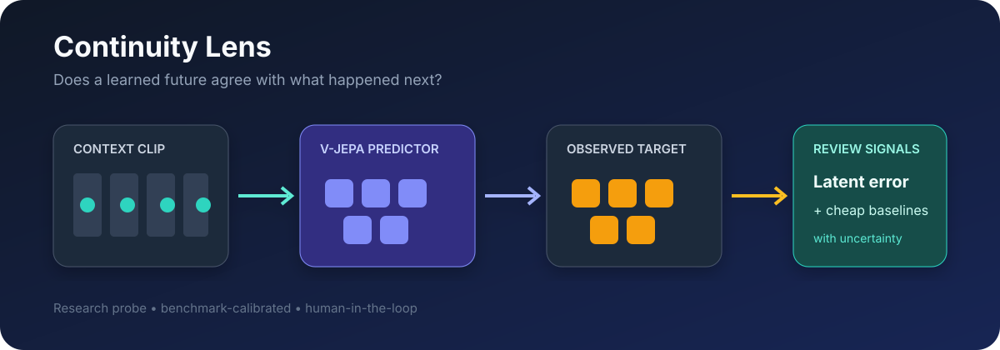
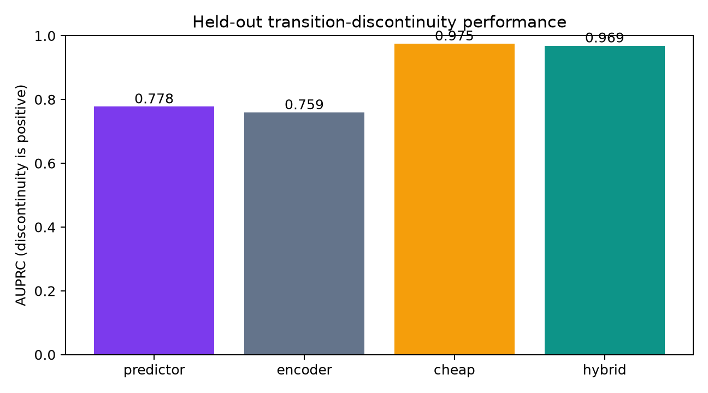
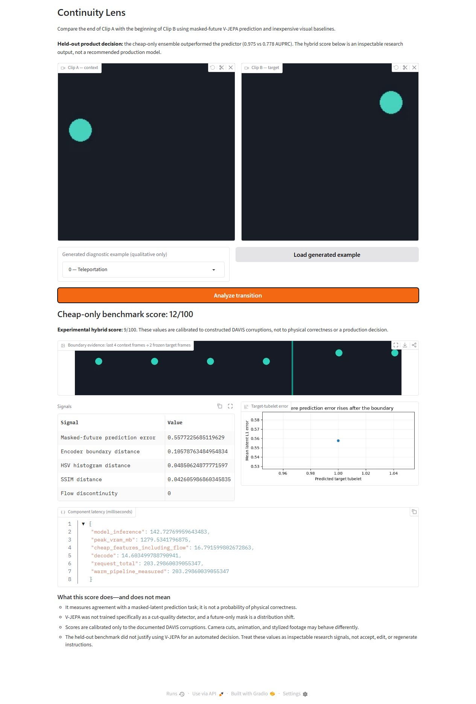

# Continuity Lens

> Does masked-future latent prediction identify implausible video transitions better than inexpensive pixel, similarity, and optical-flow signals?

Continuity Lens is a research-to-product case study built around V-JEPA 2. It predicts the latent representation after a video boundary, compares that prediction with what actually occurred, and evaluates whether the error adds value beyond inexpensive visual baselines.



## Current evidence status

| Component | Status |
|---|---|
| Reproducible environment, CLI, fake-model CI | Implemented |
| Explicit V-JEPA source/checkpoint loader | Verified on RTX 5080 with the official 5.1 GB checkpoint |
| DAVIS 60/30 grouped benchmark | Completed; media stays local and predictions are downloadable |
| Frozen held-out result | Completed once under protocol `24a0e6d5`; cheap signals outperformed |
| Discovery and usability | Archetype proxy and expert walkthrough only; no human-validation claim |

The repository never ships invented user evidence or placeholder benchmark numbers.

## Held-out result

On 30 held-out DAVIS source groups (270 primary transitions), the cheap-only ensemble reached
0.975 AUPRC versus 0.778 for masked-future prediction error. The point ΔAUPRC was −0.197;
the 5,000-resample source-grouped 95% bootstrap interval was [−0.229, −0.143]. The hybrid
also trailed cheap-only: 0.969 AUPRC, Δ interval [−0.0122, −0.0002].



The result does not show that latent prediction is generally useless. It shows that on these
programmatic within-video corruptions, flow and appearance changes are already highly diagnostic,
and the V-JEPA error does not justify its added complexity. See the [case study](docs/case-study.md)
for failure analysis and scope limits.

## Why a latent predictor?

Encoder cosine distance mainly asks whether two scenes look alike. Continuity requires a different question: given the context before a boundary, is the observed future close to what a learned video representation predicts?

The headline signal is therefore **masked-future latent prediction error**. V-JEPA is not treated as a causal simulator, and the score is not presented as a probability of physical correctness.

## Quick start

Requirements: Python 3.11, `uv`, and—only for the real V-JEPA run—an NVIDIA GPU with a compatible CUDA 12.8 PyTorch build.

```powershell
uv sync --locked
uv run continuity-lens doctor
uv run continuity-lens check
```

The quality gate uses fake modules and never downloads a checkpoint. To explicitly download and load the real V-JEPA model:

```powershell
uv run continuity-lens doctor --model
```

The official checkpoint is roughly 5.1 GB and is cached outside Git. The loader intentionally
bypasses the upstream `localhost:8300` Hub value by instantiating the exact pinned source with
`pretrained=False` and loading the official checkpoint URL explicitly. PyTorch Hub's mutable
fork-validation API is skipped because the immutable commit SHA is already the source identity.

## Run the benchmark

```powershell
uv run continuity-lens data prepare
uv run continuity-lens benchmark --split dev
uv run continuity-lens benchmark --split test --frozen
```

Development evaluation selects the future horizon, fits the inexpensive and hybrid calibrators, and writes a hashed protocol. The held-out command refuses to run if the data manifest or scoring source changed, and it refuses to overwrite an existing test result.

For a fast end-to-end plumbing check that is never suitable for reported results:

```powershell
uv run continuity-lens benchmark --split dev --mock-model
uv run continuity-lens benchmark --split test --frozen --mock-model --bootstrap-resamples 100
```

## Launch the product prototype

```powershell
uv run continuity-lens data demos
uv run continuity-lens app
```

The first command creates six self-owned qualitative clip pairs at the frozen horizon; they appear
as selectable examples and remain ignored by Git. You can also upload the context clip and target
clip separately. The app samples unique decoded frames, rejects undersized videos instead of
repeating frames, and shows:

- Cheap-only and experimental hybrid benchmark scores, once development calibration exists.
- V-JEPA prediction error and encoder distance.
- Histogram, SSIM, and optical-flow baselines.
- A boundary strip with four context frames and the frozen target horizon, a target-tubelet error
  curve, and measured decode, feature, model, and total latency.
- Plain-language limitations next to the result.



[Watch the two-minute captioned walkthrough](docs/assets/continuity-lens-demo.mp4).

Use `--mock-model` only to exercise the interface without the checkpoint.

Reproduce the post-benchmark auxiliary evidence with:

```powershell
uv run continuity-lens walkthrough
uv run continuity-lens diagnostics
uv run python scripts/render_demo.py
```

The walkthrough records real system outputs for all six owned examples; it is not human-usability
evidence. Diagnostics score twelve controlled geometry cases and remain outside the headline
benchmark.

## Evaluation contract

- DAVIS train: 60 development source groups.
- DAVIS val: 30 held-out source groups, touched only after the protocol freeze.
- Three anchors per source: continuous, temporal skip, and target-block reorder are primary; matched cross-video splices are secondary.
- Primary metric: held-out ΔAUPRC between predictor error and the cheap-only ensemble.
- Uncertainty: 5,000 paired bootstrap resamples grouped by source video.
- Reporting: positive interval, negative interval, or inconclusive—never a pre-committed winner.

See the [case study](docs/case-study.md), [evaluation card](docs/evaluation-card.md),
[benchmark provenance](docs/provenance.md), [product brief](docs/product-brief.md), and
[prior-art matrix](docs/prior-art.md). The [evidence register](docs/evidence-register.md) separates
measured results from hypotheses and simulated review. The
[synthetic diagnostic report](docs/diagnostic-report.md) documents an auxiliary stress-test failure
without expanding the headline claim.

## Repository principles

- The public story is employer-neutral and reusable.
- Checkpoints, datasets, uploaded media, private interview notes, and recordings are ignored by Git.
- Synthetic examples are diagnostics, not the primary benchmark.
- A public remote or release is never created without explicit human review.

## License and attribution

Project code is MIT licensed. V-JEPA 2 and DAVIS remain governed by their respective licenses and citation requirements; see [third-party notices](THIRD_PARTY_NOTICES.md). No model checkpoint or DAVIS media is redistributed here.
