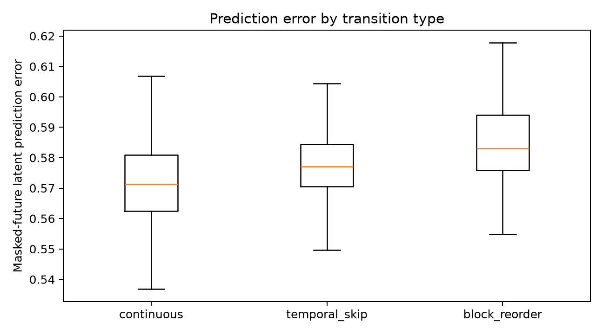

# Continuity Lens case study

## Executive summary

Continuity Lens turns a learned video-prediction representation into an inspectable boundary-review workflow, then asks whether that expensive signal beats inexpensive alternatives on held-out real video.

The portfolio value is the decision trail: validate the problem separately from the interface, compare against credible baselines, freeze the evaluation before test, expose latency and limitations, and report uncertainty rather than selecting a convenient headline.

## Technical decision trail

### Why V-JEPA 2 ViT-L instead of V-JEPA 2.1 Base?

The 2.1 Base Hub entry returns an encoder and predictor, but the released distilled predictor projects into a 1664-dimensional teacher space while the Base encoder emits 768-dimensional representations. Comparing those tensors directly would be methodologically invalid without the teacher. V-JEPA 2 ViT-L provides compatible context, EMA target, and predictor states for the intended latent-error experiment.

### Why bypass `pretrained=True`?

The pinned Meta source contains a debug `http://localhost:8300` base URL. Continuity Lens
instantiates the exact source revision without pretrained weights and loads the explicit official
checkpoint. The immutable SHA also lets the loader skip PyTorch Hub's separate GitHub
fork-validation request, which can fail independently of source availability. The run manifest
captures the source SHA, checkpoint URL, and checkpoint SHA-256.

### Why 16 frames?

Short windows keep the prototype feasible on a 16 GB GPU and allow development comparison of 2-, 4-, and 8-frame future horizons. The chosen horizon is frozen before test. This is a masked-future probe, not a claim that V-JEPA learned causal rollout.

## Research protocol

DAVIS train supports selection and calibration. DAVIS val is held out. The scoring code, data manifest, fitted coefficients, expected row count, and model manifest are hashed into the frozen specification. Test execution refuses a changed hash or an existing output directory.

The primary comparison is prediction error versus a fitted cheap-only ensemble. The hybrid result answers the product question—whether combining signals helps—while the predictor-only delta answers the research question.

## Product translation

The local application keeps the human in the loop. It shows the boundary frames, five component scores, error over target tubelets, measured latency, and limitations. A single calibrated score is useful for ordering review, but never replaces the evidence underneath it.

## Results

Development selected the 2-frame future horizon: predictor AUPRC was 0.776 for 2 frames,
0.726 for 4, and 0.759 for 8. That decision, the fitted calibrators, source tree, data manifest,
expected counts, and checkpoint identity were frozen under protocol hash `24a0e6d5…` before the
held-out command was allowed to run.

The one-time held-out pass covered 30 source groups and 270 primary transitions at 2:1 constructed
positive prevalence. Results:

The [provenance note](provenance.md) distinguishes the frozen test-time package from UI-only demo
improvements made afterward; no second held-out run was made.

| Signal | AUPRC | AUROC |
|---|---:|---:|
| Masked-future predictor error | 0.778 | 0.674 |
| Encoder boundary distance | 0.759 | 0.645 |
| Cheap-only ensemble | **0.975** | **0.950** |
| Hybrid | 0.969 | 0.933 |

The predictor-minus-cheap point estimate was −0.197 AUPRC. The 5,000-resample paired bootstrap
median was −0.192 with a source-grouped 95% interval of [−0.229, −0.143]. The hybrid-minus-cheap
interval was also entirely below zero: [−0.0122, −0.0002]. Under the precommitted reporting rule,
**cheap signals outperform** on this benchmark.

### Error analysis and product decision

Prediction error moved in the expected direction on average, but distributions overlapped heavily.
High-motion natural boundaries such as `motocross-jump` and `breakdance` produced some of the
largest continuous-case errors. Conversely, several `drift-straight` and `bmx-trees` temporal skips
had low predictor error. In those cases, adding prediction error reduced a correct or useful cheap
score, explaining why the hybrid slightly regressed.

Warm V-JEPA inference averaged 136 ms per transition versus 17 ms for cheap features, with 1.28 GB
peak measured CUDA allocation. The product decision is therefore **do not deploy the V-JEPA signal
for this task from this evidence**. Preserve the app as an inspectable research artifact, use cheap
signals as the operational baseline, and invest next in a creator-authored benchmark before further
model work.

This is not evidence that world-model signals cannot help real generative-video failures. DAVIS is
out of domain, the corruptions reward flow, the future-only mask differs from pretraining, and AUPRC
reflects the constructed 2:1 prevalence.

## Next experiment

Create an owned, consented benchmark of creator-identified failures with severity labels,
intentional-cut controls, and repeated judgments. Evaluate recall at a fixed review budget and
compare a retrained continuity head, V-JEPA prediction error, and a smaller learned quality model
under equal latency constraints. The key test is not another aggregate AUPRC on synthetic skips;
it is incremental recall of creator-identified failures at a fixed review budget.
