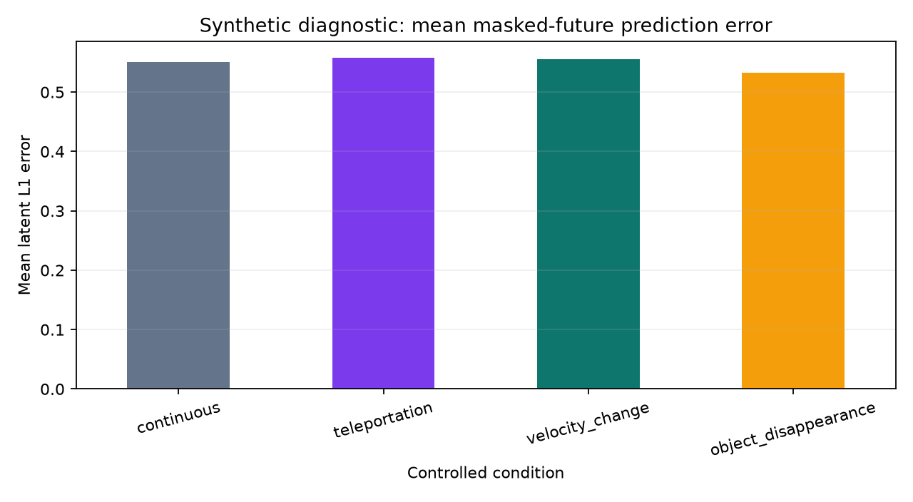

# Controlled synthetic diagnostic

## Evidence boundary

Evidence label: **EMPIRICAL — controlled synthetic diagnostic; not headline evidence**. Twelve
self-generated geometry cases test whether signals move directionally for teleportation, velocity
change, and object disappearance. The suite is deliberately excluded from model selection and all
claims about real or generative video.

## Results

| Condition | Cases | Mean prediction error | Mean encoder distance |
|---|---:|---:|---:|
| Continuous | 3 | 0.5508 | 0.0831 |
| Teleportation | 3 | 0.5574 | 0.0999 |
| Velocity change | 3 | 0.5552 | 0.1073 |
| Object disappearance | 3 | 0.5321 | 0.0774 |

Across nine anomaly-versus-matched-continuous comparisons, prediction error moved in the expected
direction five times and encoder distance six times. The frozen hybrid threshold detected **0 of 9
anomalies**. Farneback flow discontinuity was zero throughout because the moving object occupies a
small portion of the frame and the feature uses median flow magnitude.

## Interpretation

The suite falsifies a tempting qualitative story: a conspicuous object-level discontinuity does not
necessarily create a large global latent or median-flow error. Object disappearance was especially
revealing—the mean prediction error was lower than for continuous motion. This supports three
decisions:

1. Do not use the generated examples to imply that the calibrated risk detects their known labels.
2. Remove accept/edit/regenerate recommendations from the app.
3. A next model experiment should test localized token aggregation or object-conditioned masks,
   rather than another global-score threshold.

Exact predictions and machine-readable summaries are in `artifacts/diagnostic/`.
